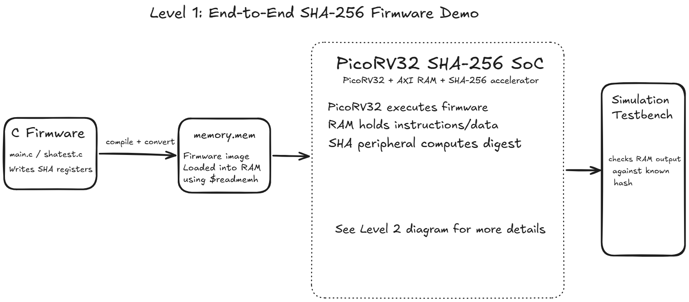
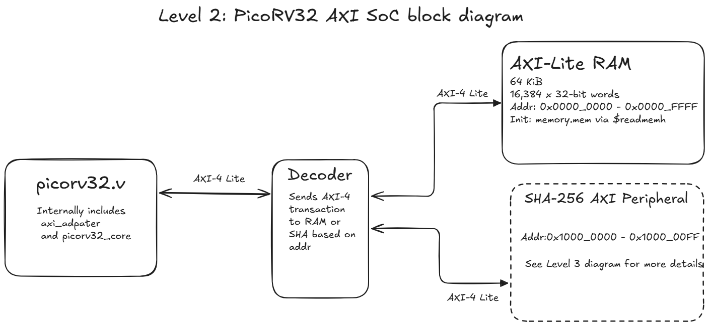
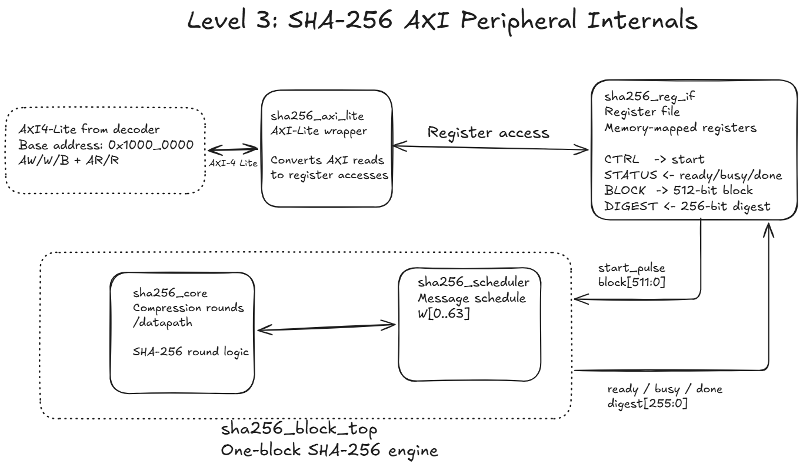

# PicoRV32 SHA-256 SoC

## Overview


## Current Status

## Architecture


## SHA-256 Peripheral Internals


## Memory Map
| Memory Region | Purpose |
|----------|----------------------:|
|0x0000_0000 - 0x0000_FFFF |  64 KiB AXI RAM |
|0x1000_0000 - 0x1000_00FF |  SHA-256 peripheral |

See the [memory map documentation](docs/memory_map.md) for more details.
## Examples


## Building Firmware
After editing [main.c](firmware/main.c) as needed, run:
```
riscv32-unknown-elf-gcc \
  -march=rv32i \
  -mabi=ilp32 \
  -nostdlib \
  -nostartfiles \
  -ffreestanding \
  -T linker.ld \
  start.S main.c \
  -o firmware.elf
```
to compile, then convert to binary using:
```
riscv32-unknown-elf-objcopy -O binary firmware.elf firmware.bin
```
then convert to a .mem file:
```bash
python firmware/bin_to_mem.py
```

## Testing
link testing md here

## Limitations

## Documentation
